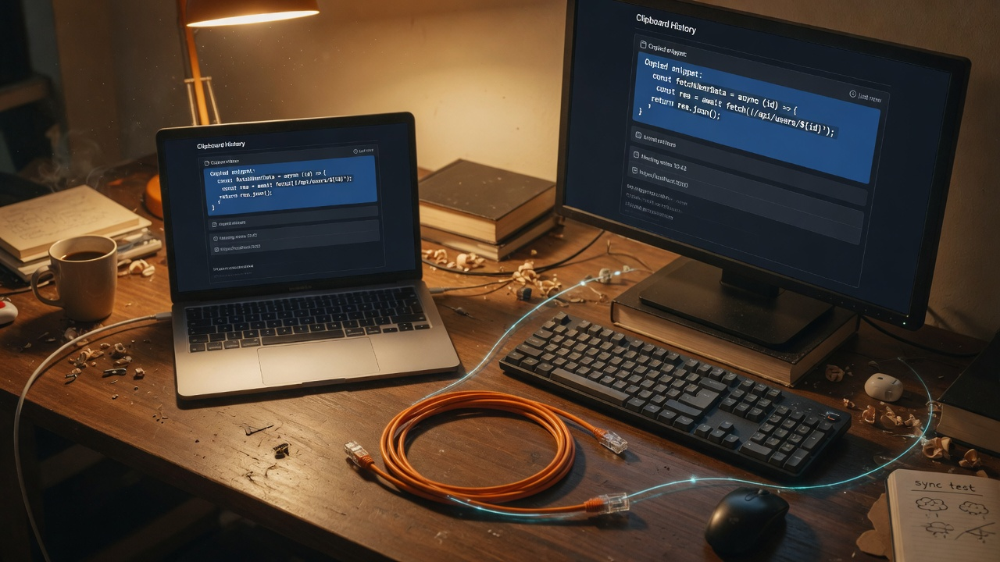

# ClipSync

> **Experimental — not recommended for use yet.** ClipSync is under active repair and validation. Use it only for isolated testing until the remaining release checks are complete.

<p align="center">
  
</p>

ClipSync synchronizes plain-text clipboards between explicitly trusted macOS and Linux devices. It uses direct connections, local discovery, Ed25519 device identities, and mutually authenticated TLS 1.3. No cloud service is involved.

The repaired transport uses protocol **2.0.0**: update both devices together. It intentionally refuses the old plaintext protocol.

## Current scope

- Plain text up to 5 MiB; automatic polling every 250 ms.
- macOS NSPasteboard, Linux X11, and Wayland compositors supporting data-control through arboard. Arboard can fall back to X11 where available.
- Explicit peer authorization, automatic discovery, bounded reconnect backoff, stale/duplicate event rejection, and remote-update echo suppression.
- The latest local event is retained in memory for newly connected sessions. Starting a daemon does not automatically broadcast pre-existing clipboard contents; use `sync` to request that.
- AES-256-GCM encrypted history **contents**. Database metadata is not encrypted. The current retention limit is 20 entries.
- Separate `status`, `peers`, and `sync` commands communicate with the daemon through a protected per-user Unix socket. `sync` reports **queued** peers, not confirmed remote application.

Images, RTF synchronization, global hotkeys, and primary-selection configuration are not supported by the repaired sync engine. Sensitive-content filtering is a heuristic and can suppress ordinary text; it is not a guarantee that every secret will be detected.

## Build and pair

Build with a current stable Rust toolchain:

```sh
cargo build --release --locked
```

On Linux, install the native build dependencies (`pkg-config`, OpenSSL and X11/XCB development packages). See [the disposable test image](scripts/test/Dockerfile.repair) for a working Debian setup.

Create a dedicated unencrypted Ed25519 identity on each device:

```sh
ssh-keygen -t ed25519 -f ~/.ssh/id_ed25519_clipsync
```

ClipSync cannot unlock passphrase-protected identities. Keep the dedicated private key owner-readable only. Configure its path; do not replace an existing SSH key.

Example `config.toml` (use a separate file on each device):

```toml
listen_addr = "0.0.0.0:8484"

[auth]
ssh_key = "~/.ssh/id_ed25519_clipsync"
authorized_keys = "~/.config/clipsync/authorized_keys"

[clipboard]
history_db = "~/.local/share/clipsync/history.db"
# Optional: only set for a NEW isolated store. Existing stores retain their old key location.
# history_key = "/absolute/path/to/isolated/history.key"
```

Exchange only the `.pub` files through a trusted channel. Verify their fingerprints out of band (`ssh-keygen -lf peer.pub`), then authorize the other device on **both** sides:

```sh
clipsync --config /path/to/config.toml auth add /path/to/peer.pub --name desktop
clipsync --config /path/to/config.toml auth list
clipsync --config /path/to/config.toml start --foreground
```

The daemon does not prompt for trust on standard input. Discovery never grants authorization. Copy ordinary text on either device and paste on the other. A non-default port is advertised automatically.

In another terminal, using the same configuration:

```sh
clipsync --config /path/to/config.toml status
clipsync --config /path/to/config.toml peers
clipsync --config /path/to/config.toml sync
clipsync --config /path/to/config.toml history
clipsync --config /path/to/config.toml copy "example text"
clipsync --config /path/to/config.toml auth remove 'SHA256:fingerprint-from-auth-list'
```

On Linux, `copy` requires a running daemon with the same configuration. The daemon
keeps ownership after the CLI exits; success confirms the local clipboard write.
Sensitive-content filtering still controls whether that text enters history or
is forwarded to another device. If the daemon is unavailable, `copy` fails
without replacing the clipboard.


Authorization is reloaded for new handshakes and checked during active traffic/heartbeats. Removing a key closes its session. Local `auth list` now uses standard OpenSSH fingerprints; pre-repair trust-cache fingerprints are not used to authorize the daemon.

Existing launchd/systemd service installations must point at the repaired binary and run `start --foreground`. Foreground operation is the directly tested deployment path. Linux background `start` execs a fresh process and waits for readiness instead of forking a live async runtime.

## History recovery

Never delete or replace an existing history key to fix an error. An unreadable, malformed, missing, or insecurely permissioned key causes initialization to fail without replacing the key or database. Fix its permissions or restore the original key from backup. Back up the key together with the database. See [security and compatibility](docs/SECURITY.md).

## Verification

```sh
just check          # formatting and Clippy
just test           # unit/integration tests; private named pasteboards on macOS
just test-desktop   # Docker: Linux suite plus two real X11 and two headless Wayland daemons
```

The desktop harness refuses to run outside its disposable container. It generates temporary identities and history stores and does not mount personal configuration or clipboard sockets.

See [repair validation](docs/REPAIR_VALIDATION.md) for evidence and limits. Dual licensed under [MIT](LICENSE-MIT) or [Apache-2.0](LICENSE-APACHE).
